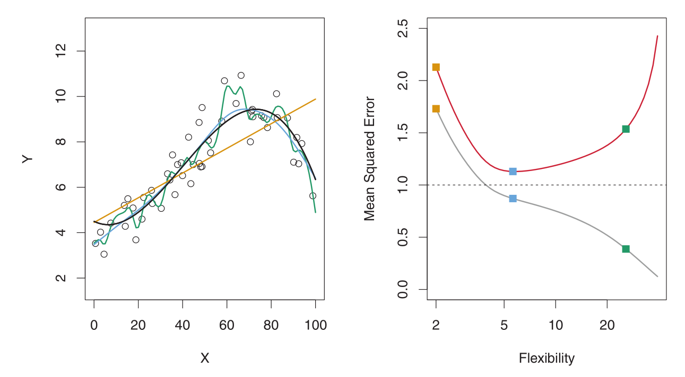

Data Science in Hong Kong
========================================================
author: Guy Freeman
date: 22nd April 2015

Why you need to know about Data Science
===

Even if you're not a data scientist or statistician or business analyst, you need to become familiar with the concept of data science (or statistics, or... etc). Here's why:

What is Data Science?
========================================================

from http://drewconway.com/zia/2013/3/26/the-data-science-venn-diagram

Data Science is many things
====

* Statistical knowledge
* Programming/hacking skills
* Domain expertise

Data science is statistics
===

Most obviously, data science requires statistical thinking and knowledge. This means, fundamentally, turning data into inferences about phenomena. 

How can you develop statistical thinking? I got a Master's degree and then a PhD in Statistics, but maybe not everyone has the time to do that...

Data science is statistics
===

You need knowledge of some statistical/machine learning techniques, but actually you *don't need a deep theoretical understanding* of how they work. What matters is to know the *strengths and weaknesses* of each technique, and how to validate the choice of a statistical model. 

Data science is programming (aka "hacking"!)
===

Data is an electronic commodity now, and especially in large quantities (did someone say *big data*??), demands extensive programming to handle it. 

There's no need to learn C or Java... It's enough to learn a friendly general-purpose language like python or the domain-specific language R. I have used R almost every day for over a decade.

Data science is programming (aka "hacking"!)
===

And now the biggest commercial provider of R has been bought by Microsoft!

http://blogs.technet.com/b/machinelearning/archive/2015/04/06/microsoft-closes-acquisition-of-revolution-analytics.aspx

Data science is domain knowledge and expertise and communication
===

Programming and statistics are not enough. In order to provide value and contribute to projects, a data scientist must know about the specific issue or system at hand, and perhaps more importantly, be able to ask questions if necessary to know how to frame the problem. 

And of course, the data scientist must then communicate findings back to any and all stakeholders.

Data science is domain knowledge and expertise and communication
===

Data science is domain knowledge and expertise and communication
===

Data scientist vs analyst
===

from http://sloanreview.mit.edu/article/getting-value-from-your-data-scientists/

Data science in Hong Kong
====

I have been fortunate to be here in Hong Kong during the start of the data science revolution. Here are some of the organisations I've been involved with:

* School of Public Health, HKU
* Open Data Hong Kong
* DemystData
* EY (formerly Ernst & Young)

School of Public Health, HKU
===

The University of Hong Kong has a well-deserved reputation as being one of Asia's top research universities. I spent three years at the School of Public Health as a Post-Doctoral Fellow focusing on the statistics of influenza prevalence. 

Open Data Hong Kong
===

Around two years ago, a group of like-minded people started an informal organisation dedicated to Open Data, i.e. data that is "that can be freely used, reused and redistributed by anyone". We believe that the government, in particular, should release whatever data it holds in an open way.

Still going strong, the ODHK Facebook group has over 1500 members, and only yesterday hosted a talk given by Hong Kong's Office of the Government Chief Information Officer.

Open Data Hong Kong
===

We are seeing some progress in the government's attitude to opening its data, although it continues to fall behind in particular with regards to company registry and lands data. Hong Kong's economy and development will massively benefit from a strong foundation of governmental open data.

http://www.scmp.com/lifestyle/technology/innovation/article/1740277/more-apps-way-opening-government-data

DemystData
===

Hong Kong's startup scene continues to burgeon. 

DemystData was one of the first of the current era of tech startups, having been founded in 2010. Its mission was to provide credit scores for people who traditionally don't have one, in order to unlock finance for poorer people all over the world. We did this by unlocking new data sources (including social network data from Facebook, Twitter et al) and sophisticated statistical models. 

So far DemystData have raised over US$5 million.

EY
===

I am currently at EY Hong Kong, joining our relatively new Enterprise Intelligence team. 

> We define Enterprise Intelligence as an organization’s ability to optimize its performance by:

> Identifying relevant information

EY
===

> Analyzing it in such a way that produces insights that are deeper than their competitors’

> Being able to act upon these insights

http://performance.ey.com/2013/08/13/enterprise-intelligence-aligning-needs-and-goals/

Data science activities in Hong Kong 
===

* R User Group

https://www.facebook.com/groups/hkrusers/

* Analytics Community

Launch on May 7th! http://www.eventbrite.com/e/hk-analytics-community-launch-registration-16171908614

Thank you
===

I look forward to your questions.
